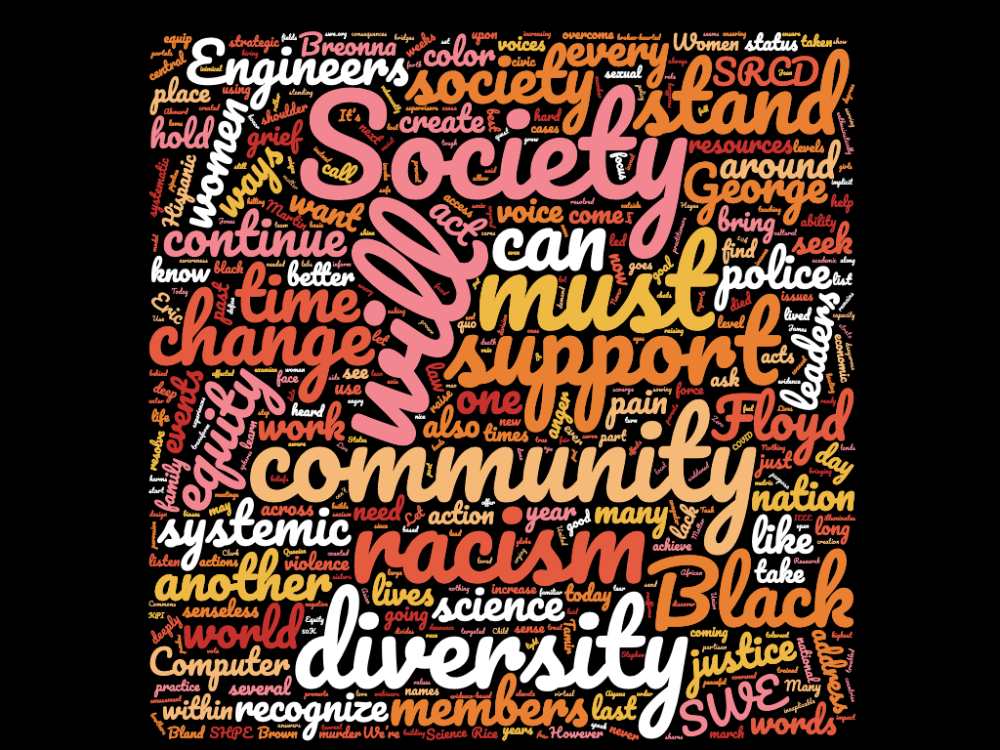
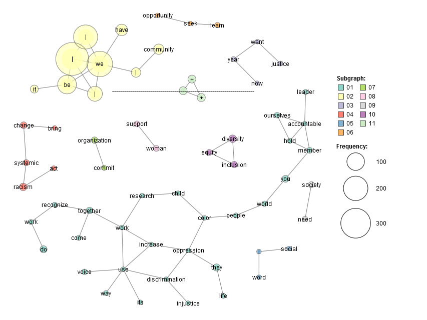

# Decoding Diversity Statements

*Description:* In May and June 2020, nationwide protests against police brutality and systematic racism in the U.S.
 prompted many organizations to issue public statements addressing the key issues of the protests. 
 

This project uses text analysis and visualization to analyze the statements issued by the academic and research community,
 with a focus on computing research organizations.
 

*Contributors:* Dr. Jasmine Jones, Dr. Jaye Nias, Imani Sherman, Tawanda Kumbula, and Anisa Thomas

## Our Work in Progress

<figure>
  <figcaption><i>A thousand words: what do statements against racism really say?</i></figcaption>
  
</figure>

<figure>
 <figcaption><i>Starting to explore themes through co-occuring words (@jclarknias).</i></figcaption>
 
</figure>

